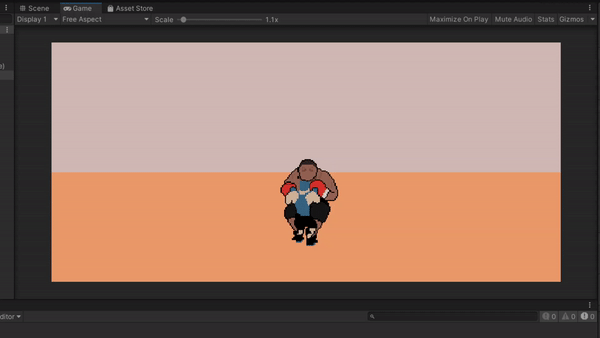
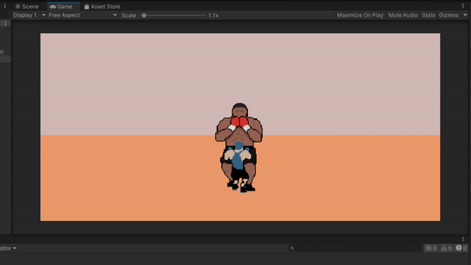

## SachasBoomNBang_Unity
A 2D, top-down, fighting game. Gameplay is directly from Punch Out.

## Motivation
A game for a friend, as well as a learning experience for a different game genre.
 
## Screenshots

## Tech/framework used
<b>Built with</b>
- [Unity 2020.3.4](https://unity.com/)

## Game Installation
Game is unfinished. Access the unity project by putting the "Sacha's Boom N' Bang" folder in Unity project files.

## Credits
The link to the relevant YouTube videos and StackOverflow pages I referenced/used are present within the scripts of the game.
